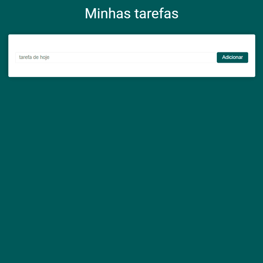

<div align="center">

</div>

### Minhas Tarefas
App feito com vueJS usando components, comunicação com propriedade e armazenamento no localStorage.<br>Praticando atividade do curso do Sujeito Programador. <br />
[Link da aplicação](http://minhas-tarefas.caiogomesdev.link/)
### Get started
```
# Instale as dependência:
$ npm install

# Para desenvolvimento:
$ npm run serve

# Para produção:
$ npm run build
```

---

### Configuração personalizada
Siga a [Documentação oficial](https://cli.vuejs.org/config/).